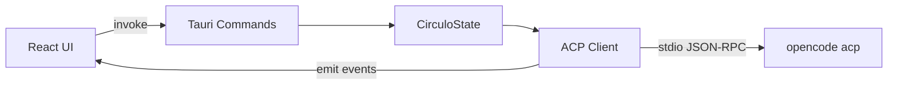

# Circulo

Orquestador de escritorio para agentes de IA basado en **[ACP (Agent Client Protocol)](https://agentclientprotocol.com/)**.

Circulo es un cliente nativo ligero para trabajar con agentes CLI — OpenCode, y en el futuro Cline, Grok CLI, Gemini CLI y cualquier herramienta compatible con ACP. La UI está inspirada en [Palot](https://github.com/ItsWendell/palot), pero Circulo **no** usa backends HTTP/SSE: todo el tráfico va por **JSON-RPC sobre stdio** a través del core Rust de Tauri.

---

## Características

### Chat y agente

- Streaming en tiempo real vía eventos ACP (`session/update`)
- **New Thread** y **New Chat** con flujos separados
- Selector de **modelo** con búsqueda, grupos por proveedor y favoritos
- Selector de **modo agente**: Ask before changes, Edit automatically, Plan mode, Full access
- Selector de **thinking / effort** cuando el agente lo expone
- **Plan mode** con tarjeta de preview en Markdown (aceptar, comentar, rechazar, descargar)
- Menciones `@` con autocompletado de archivos del workspace
- Gate de permisos **Aprobar / Denegar** (nunca se omiten)
- Visualización de tool calls (read, search, execute, edit, fetch)
- Diffs inline con resaltado de sintaxis (Shiki)

### Proyectos y sesiones

- Sidebar con proyectos recientes, alias personalizados y carpetas expandibles
- Multi-sesión ACP (`session/list`, `session/new`, `session/load`)
- Sesiones **pinned**, **archivadas** y acciones por sesión (renombrar, eliminar)
- Nueva sesión por proyecto desde el sidebar
- Chat general sin carpeta de proyecto (`General Chat`)

### Interfaz nativa

- Ventana macOS con titlebar overlay, traffic lights integrados y arrastre nativo
- Efecto **frosted glass** en el shell de la ventana (vibrancy nativa + tinte)
- Sidebar redimensionable con ancho persistido
- Chrome oscuro estilo Palot/ZCode (`#282828` sidebar, `#161616` contenido)

---

## Stack

| Capa | Tecnología |
|------|------------|
| Core | [Tauri v2](https://v2.tauri.app) + Rust |
| Protocolo | [ACP](https://agentclientprotocol.com/) (`agent-client-protocol` crate) |
| Runtime JS | [Bun](https://bun.sh) |
| Frontend | React 19 + Vite 7 + Tailwind CSS v4 |
| Estado | Jotai |
| Markdown | react-markdown + remark-gfm + @tailwindcss/typography |
| Diffs | @pierre/diffs + Shiki |
| Primer agente | [OpenCode](https://opencode.ai) (`opencode acp`) |

---

## Requisitos

- **Bun** 1.3+
- **Rust** stable ([rustup](https://rustup.rs))
- **macOS**: Xcode Command Line Tools (para compilar Tauri)
- **OpenCode CLI** en `PATH` con al menos un proveedor configurado

```bash
# Verificar herramientas
bun --version
rustc --version
opencode --version
opencode acp --help
```

### Instalar OpenCode

```bash
curl -fsSL https://opencode.ai/install | bash
opencode   # configurar proveedor de modelos
```

---

## Inicio rápido

```bash
git clone <repo-url>
cd circulo
bun install
bun run tauri:dev
```

1. La app arranca en **General Chat** o abre un proyecto desde el sidebar (**Add Project**).
2. Circulo lanza `opencode acp` automáticamente con `cwd` en la carpeta del proyecto.
3. Escribe en el chat; usa `@` para referenciar archivos.
4. Aprueba o deniega permisos cuando el agente lo solicite.

---

## Scripts

| Comando | Descripción |
|---------|-------------|
| `bun run dev` | Solo frontend Vite (`:1420`) |
| `bun run tauri:dev` | App de escritorio completa (recomendado) |
| `bun run tauri:build` | Build de producción (.app / .dmg) |
| `bun run build` | Build del frontend |
| `bun run check-types` | Typecheck TypeScript |

### Debug ACP (Rust)

```bash
RUST_LOG=info bun run tauri:dev
```

---

## Estructura del proyecto

```
circulo/
├── src/                          # Frontend React
│   ├── components/
│   │   ├── chat/                 # Input, mensajes, selectores, plan preview
│   │   ├── layout/               # Sidebar, app shell, window chrome
│   │   ├── tools/                # Tool call cards
│   │   ├── permissions/        # Tarjeta de permisos
│   │   └── diff/                 # Bloques inline diff
│   ├── hooks/                    # ACP session, event bridge, plan actions
│   ├── lib/                      # Puente Tauri, parser ACP, preferencias
│   └── stores/                   # Atoms Jotai
├── src-tauri/
│   └── src/
│       ├── acp/runner.rs         # Cliente ACP + event bridge
│       ├── commands/mod.rs       # API invoke hacia el frontend
│       ├── state.rs              # Estado compartido (CirculoState)
│       ├── session_store.rs      # Persistencia de sesiones
│       └── agents/mod.rs         # Definición del agente OpenCode
├── docs/
│   ├── ARCHITECTURE.md
│   ├── ACP.md
│   └── DEVELOPMENT.md
└── AGENTS.md                     # Instrucciones para agentes de código
```

---

## Arquitectura (resumen)



La UI **nunca** habla directamente con OpenCode. Todo pasa por comandos Tauri y eventos (`acp:session_ready`, `acp:session_update`, `acp:permission_request`, `acp:prompt_complete`, etc.).

| Comando Tauri | Descripción |
|---------------|-------------|
| `open_project` | Spawn agente + sesión ACP |
| `close_project` | Shutdown + cleanup |
| `send_prompt` | Prompt con contexto `@` |
| `respond_permission` | Resuelve gate de seguridad |
| `set_config_option` | Modelo, modo, thinking, etc. |
| `search_files` | Autocompletado `@` |
| `list_sessions` / `create_session` / `load_session` | Multi-sesión |

Documentación detallada: [docs/ARCHITECTURE.md](docs/ARCHITECTURE.md) · [docs/ACP.md](docs/ACP.md)

---

## Seguridad

- Los permisos ACP **bloquean** el agente hasta que el usuario responde.
- Las lecturas de archivos para `@` están acotadas al root del proyecto abierto.
- Capabilities Tauri mínimas: `dialog`, `opener`, drag de ventana.
- Circulo no ejecuta herramientas del agente sin pasar por el gate de permisos.

---

## Roadmap y planificación

- **[ROADMAP.md](ROADMAP.md)** — análisis comparativo vs [soycanopa/circulo](https://github.com/soycanopa/circulo), [OpenChamber](https://github.com/openchamber/openchamber), [Synara](https://github.com/Emanuele-web04/synara) y [Craft Agents](https://github.com/craft-ai-agents/craft-agents-oss) (referente de polish en chat: diffs, previews, planes, credenciales)
- **[SKILLS.md](SKILLS.md)** — skills recomendados de [skills.sh](https://skills.sh/) para desarrollar Circulo

---

## Desarrollo

Ver [docs/DEVELOPMENT.md](docs/DEVELOPMENT.md) para setup, debugging ACP, convenciones de commits y cómo añadir agentes.

Para agentes de código (Cursor, Grok, Claude): [AGENTS.md](AGENTS.md)

---

## Licencia

MIT — UI inspirada en [Palot](https://github.com/ItsWendell/palot) (MIT).