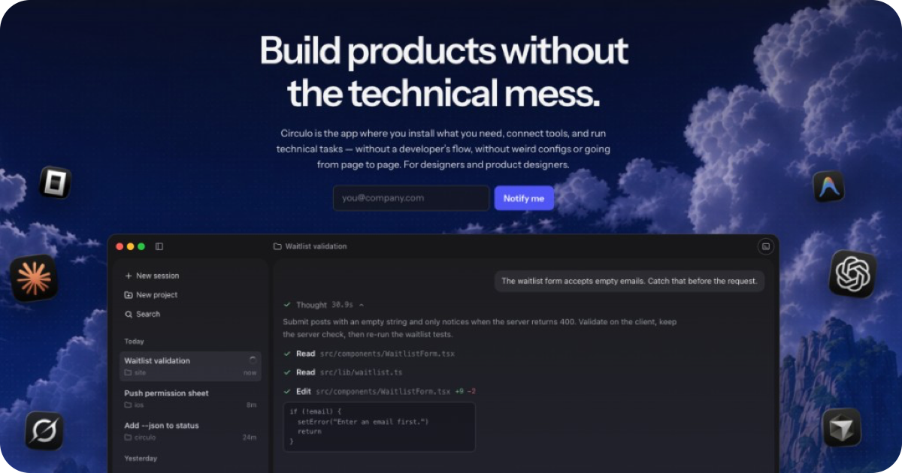

<div align="center">

# circuloGo

**Your coding agent, without living in the terminal.**

A native desktop window where [OpenCode](https://opencode.ai) works live: streaming
answers, visible thinking, approval cards, diffs and real terminals — all in one
place. Local-first: the app, the sessions and the terminals run on your machine, and
circuloGo adds no cloud of its own.

[Getting started](#getting-started) · [How it works](#how-it-works) · [Docs](docs/) · [AGENTS.md](AGENTS.md)


<!-- Drop a screenshot at docs/screenshot.png and uncomment:

-->

</div>

## Why circuloGo

Coding-agent CLIs are powerful — and hostile: one stream of text, permission prompts
buried in scrollback, zero memory of what belongs to which task. circuloGo gives the
agent a **real home**: a native window where work streams as it happens, decisions
arrive as cards you answer with a click, and every project keeps its sessions,
branches and terminals.

## What you get

- ⚡ **Live streaming chat** — reasoning, answer and tool calls arrive as separate
  streaming parts, word by word. You watch the agent work; you don't read a
  transcript after the fact.
- 🧠 **Thinking trace** — the agent's effort grouped by kind (Reasoning / Search /
  Coding / Tools), collapsed by default, one click when you want the details.
- ✅ **Approvals without scrollback** — permission and question cards in the chat:
  one question at a time, a 1/N counter, answer with a click.
- 📊 **Code as a first-class citizen** — syntax-highlighted panels with line numbers,
  unified diffs with old/new gutters and word-level pairing, and dotted flowchart
  canvases from `circulogo-flow` blocks.
- 🖥️ **PTY terminals built in** — one tabbed terminal surface per project, right
  below the chat. No third app needed.
- 🗂️ **Sessions first** — projects (folders) hold sessions; pick project and branch
  up front; come back later and the history is exactly where you left it.
- 🔒 **Local only** — the UI never talks to anything but `127.0.0.1`. Projects,
  settings and terminals live on your disk, in your control.

## How it works

```
┌───────────┐  neutral protocol   ┌───────────┐      ┌────────────────┐
│ React UI  │ ⇄  /agent relay  ⇄  │ orchestr. │ ⇄   │ OpenCode v2    │
│ (webview) │      HTTP + SSE     │           │      │ adapter        │
└───────────┘                     └───────────┘      └───────┬────────┘
                                                    local `opencode serve`
```

The UI speaks one neutral wire protocol (`internal/agent/protocol`) and never knows
which agent is behind it — OpenCode today, more adapters later, zero UI rewrites.
Dependency direction is one-way and enforced; the full constitution lives in
[AGENTS.md](AGENTS.md).

**Stack:** Go (`internal/…`) + Wails v3 · React 18 + TypeScript + Tailwind v4 ·
vitest + Go testing. The only package allowed to speak OpenCode is
`internal/opencode`.

## Getting started

Requirements: Go, Node + pnpm, [wails3 CLI v3.0.0-beta.16](https://v3.wails.io/learn/install/),
`task` (go-task), and an `opencode` binary on `PATH` (`CIRCULOGO_OPENCODE_BIN`
overrides it — required for side-by-side v2 installs).

```sh
git clone https://github.com/soycanopa/circulo && cd circulo

task dev            # app dev mode (webview + hot reload)

# no wails3/task? build the embedded UI, then compile the app binary
pnpm -C frontend build && go build -o build/bin/circulogo .

# verify everything is green
go test ./...
pnpm --dir frontend test
```

Optional: `CIRCULOGO_DEBUG_ADDR=127.0.0.1:9246` serves the embedded UI next to the
`/agent` relay on a loopback listener for curl/script E2E without the webview.

## Status & roadmap

- **Now (v0):** adapter fully on OpenCode **v2** (verified against 2.0.8 —
  [migration notes](docs/opencode-v2-migration.md)); v0 is gated on the E2E pass in
  [docs/opencode-v2-phase6-e2e.md](docs/opencode-v2-phase6-e2e.md).
- **Next:** packaging a proper `.app` (phase plan in
  [docs/implement.md](docs/implement.md)), image attachments in the composer.
- **Later:** a second adapter (Claude, …) to prove the neutral protocol; remote
  access (design frozen in [docs/remote.md](docs/remote.md)).

> This repo previously hosted another project; its full history is preserved under
> the `legacy/*` branches.
