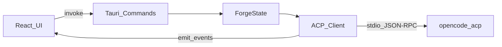

# Arquitectura de Forge

## Visión general

Forge actúa como **cliente ACP**. La UI de React nunca habla directamente con OpenCode: todo pasa por el core Rust de Tauri.



## Capas

### 1. Frontend (`src/`)

- **AppShell**: sidebar + selector de proyecto
- **ChatView**: mensajes, permisos, input
- **Jotai atoms**: estado de sesión, mensajes, permisos activos
- **acp-parser**: normaliza `session/update` a mensajes UI

### 2. Puente Tauri (`src/lib/tauri.ts`)

| Command | Descripción |
|---------|-------------|
| `open_project` | Spawn agente + sesión ACP |
| `close_project` | Shutdown + cleanup |
| `send_prompt` | Encola prompt con contexto `@` |
| `respond_permission` | Resuelve gate de seguridad |
| `set_config_option` | Cambia modelo u otras opciones |
| `search_files` | Autocompletado `@` |

| Evento | Descripción |
|--------|-------------|
| `acp:session_ready` | Sesión creada + configOptions |
| `acp:session_update` | Streaming de texto/tool calls |
| `acp:permission_request` | Solicitud de permiso bloqueante |
| `acp:prompt_complete` | Turno terminado |
| `acp:error` | Error del agente/conexión |
| `agent:disconnected` | Proceso caído |

### 3. Core Rust (`src-tauri/src/`)

- **`acp/runner.rs`**: implementa el cliente ACP con `agent-client-protocol`
- **`commands/mod.rs`**: API pública hacia el frontend
- **`state.rs`**: proyecto activo, waiters de permisos, config options

## Ciclo de vida del agente

1. Usuario abre proyecto → `open_project(path)`
2. Rust crea canal `mpsc` de comandos
3. Task async ejecuta `Client.builder().connect_with(AcpAgent)`
4. `Initialize` → `session/new` con `cwd = project_path`
5. Frontend recibe `acp:session_ready`
6. Al cerrar: `AgentCommand::Shutdown` → kill subprocess

## Seguridad

- Permisos ACP: el handler `on_receive_request` **bloquea** hasta que el usuario responde.
- `@` mentions: `read_context_file()` valida que el path canónico esté dentro del root del proyecto.
- Tauri capabilities limitadas a `dialog` + APIs core.

## Extensibilidad multi-agente

`agents/mod.rs` define el comando por defecto. Para añadir Cline:

```rust
// Futuro: registry de agentes
pub struct AgentDefinition {
    pub id: &'static str,
    pub command: &'static str,
    pub args: &'static [&'static str],
}
```

La UI y el parser ACP permanecen iguales mientras el agente hable ACP estándar.